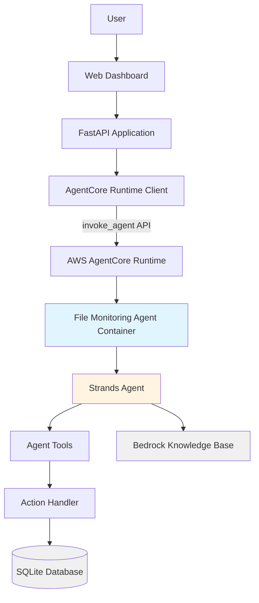
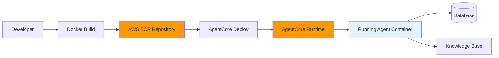

# Design Document: AgentCore Runtime Deployment

## Overview

This design describes the architecture and implementation for deploying the File Monitoring Agent to AWS Bedrock AgentCore Runtime. The current implementation uses a local agent (FileMonitoringAgent in src/ai/agentcore_client.py) that runs within the application process and directly invokes Claude via Bedrock Runtime API. This design transforms that local agent into a containerized runtime agent that can be deployed to AWS AgentCore Runtime infrastructure and invoked via API.

The deployment follows the established pattern used by existing agents in the capstone_project/backend/runtime directory (travel_companion_basic, unified_travel_companion, etc.). The runtime agent will maintain the same functionality as the local agent while gaining benefits of containerized deployment including isolation, scalability, and centralized management.

Key design goals:
- Package the agent logic into a Docker container compatible with AgentCore Runtime
- Preserve all existing tool functionality (get_system_health, get_violations, get_all_systems, compare_systems)
- Enable database access from the containerized environment
- Integrate with AWS Bedrock Knowledge Base for system documentation
- Update the application to invoke the runtime agent via API instead of local execution
- Maintain backward compatibility with the existing chat API endpoint

## Architecture

### High-Level Architecture



### Component Layers

1. **Deployment Package Layer**
   - Dockerfile: Defines container image with Python runtime and dependencies
   - .bedrock_agentcore.yaml: Configuration for AgentCore Runtime deployment
   - requirements.txt: Python dependencies including strands, bedrock-agentcore, boto3
   - .dockerignore: Excludes unnecessary files from container build

2. **Agent Logic Layer**
   - file_monitoring_agent.py: Entrypoint module implementing the agent
   - Strands Agent: Framework for building agentic AI with tool calling
   - BedrockModel: Interface to AWS Bedrock Nova Lite model
   - System Prompt: Instructions defining agent behavior and tool usage

3. **Tool Execution Layer**
   - Tool Definitions: @tool decorated functions for each database query
   - Action Handler: Executes database queries via SQLAlchemy
   - Database Models: Reused from src/database/models.py
   - SQL Query Generator: Generates optimized queries for different data requests

4. **Application Integration Layer**
   - Runtime Client: boto3 bedrock-agentcore-runtime client
   - Chat API Endpoint: Existing /api/v1/chat/agent endpoint
   - Session Management: Maintains conversation context across invocations
   - Error Handling: Graceful degradation and user-friendly error messages

### Deployment Architecture



The deployment process follows these steps:
1. Build Docker container from deployment package
2. Push container image to AWS ECR repository
3. Create AgentCore Runtime agent resource with configuration
4. Configure execution role with permissions for Bedrock, database, and logging
5. Enable observability for monitoring and debugging
6. Verify deployment and obtain agent ARN for application configuration

## Components and Interfaces

### 1. File Monitoring Agent Entrypoint

**Module**: runtime/file_monitoring_agent/file_monitoring_agent.py

**Purpose**: Main entrypoint for the AgentCore Runtime agent, implementing tool-calling logic for file monitoring queries.

**Key Components**:
- BedrockAgentCoreApp: Runtime application wrapper
- Agent: Strands agent with tool-calling capabilities
- BedrockModel: Interface to Nova Lite foundation model
- Tool Functions: Database query tools decorated with @tool

**Interface**:
```python
from strands import Agent, tool
from strands.models import BedrockModel
from bedrock_agentcore.runtime import BedrockAgentCoreApp
from agent_action_handler import AgentActionHandler

app = BedrockAgentCoreApp()

@tool
def get_system_health(system_id: str, days: int = 7) -> str:
    """Get health status and metrics for a specific system"""
    # Implementation delegates to action handler
    
@tool
def get_violations(system_ids: str = "", days: int = 7) -> str:
    """Get SLA violations for systems"""
    # Implementation delegates to action handler

@tool
def get_all_systems() -> str:
    """Get a list of all monitored systems"""
    # Implementation delegates to action handler

@tool
def compare_systems(system_ids: str) -> str:
    """Compare metrics across multiple systems"""
    # Implementation delegates to action handler

@app.entrypoint
def invoke_file_monitoring_agent(payload: dict) -> str:
    """AgentCore Runtime entrypoint"""
    user_input = payload.get("prompt", "")
    response = agent(user_input)
    return extract_response_text(response)
```

### 2. Agent Action Handler

**Module**: runtime/file_monitoring_agent/agent_action_handler.py

**Purpose**: Executes database queries for agent tools. This is a copy of src/ai/agent_action_handler.py adapted for the runtime environment.

**Key Responsibilities**:
- Parse tool parameters
- Generate SQL queries via SQLQueryGenerator
- Execute queries against database
- Format results as JSON
- Handle errors and return meaningful error messages

**Interface**:
```python
class AgentActionHandler:
    def __init__(self):
        self.sql_generator = SQLQueryGenerator()
    
    def handle_action(self, action_group: str, api_path: str, 
                     parameters: List[Dict]) -> Dict[str, Any]:
        """Execute action and return results"""
        
    def _get_system_health(self, params: Dict) -> Dict:
        """Get system health metrics"""
        
    def _get_violations(self, params: Dict) -> Dict:
        """Get SLA violations"""
        
    def _query_all_systems(self, params: Dict) -> Dict:
        """Get all monitored systems"""
        
    def _compare_systems(self, params: Dict) -> Dict:
        """Compare multiple systems"""
```

### 3. Database Connection Module

**Module**: runtime/file_monitoring_agent/database_connection.py

**Purpose**: Manage database connections in the runtime environment using environment variables for configuration.

**Configuration**:
- DATABASE_URL: Full database connection string (e.g., "sqlite:///data/file_monitoring.db")
- Reads from environment variables set in container
- Uses SQLAlchemy for database access
- Implements connection pooling for efficiency

**Interface**:
```python
def init_db(database_url: str) -> Engine:
    """Initialize database connection from environment"""
    
@contextmanager
def get_db_session() -> Generator[Session, None, None]:
    """Get database session as context manager"""
```

### 4. Runtime Client Wrapper

**Module**: src/ai/agentcore_runtime_client.py

**Purpose**: Client wrapper for invoking the deployed runtime agent from the FastAPI application.

**Interface**:
```python
class AgentCoreRuntimeClient:
    def __init__(self, agent_arn: str, region: str = "us-east-1"):
        """Initialize runtime client with agent ARN"""
        self.agent_arn = agent_arn
        self.bedrock_agentcore = boto3.client(
            "bedrock-agentcore-runtime", 
            region_name=region
        )
    
    def invoke(self, query: str, session_id: Optional[str] = None) -> Dict[str, Any]:
        """
        Invoke the runtime agent with a query.
        
        Args:
            query: User's natural language query
            session_id: Optional session ID for context
            
        Returns:
            Dictionary with response and metadata
        """
        response = self.bedrock_agentcore.invoke_agent(
            agentArn=self.agent_arn,
            sessionId=session_id or str(uuid.uuid4()),
            prompt=query
        )
        return self._parse_response(response)
    
    def _parse_response(self, response: Dict) -> Dict[str, Any]:
        """Extract response text from API result"""
```

### 5. Configuration Files

**File**: runtime/file_monitoring_agent/.bedrock_agentcore.yaml

**Purpose**: AgentCore Runtime deployment configuration.

**Key Settings**:
```yaml
default_agent: file_monitoring_agent
agents:
  file_monitoring_agent:
    name: file_monitoring_agent
    entrypoint: file_monitoring_agent.py
    deployment_type: container
    platform: linux/arm64
    aws:
      region: us-east-1
      network_configuration:
        network_mode: PUBLIC
      observability:
        enabled: true
    # Knowledge base configuration
    knowledge_bases:
      - knowledge_base_id: MJBJ5LOYSO
        description: "System documentation and troubleshooting guides"
```

**File**: runtime/file_monitoring_agent/Dockerfile

**Purpose**: Container image definition.

**Key Elements**:
- Base image: ghcr.io/astral-sh/uv:python3.10-bookworm-slim
- Environment variables: AWS_REGION, DATABASE_URL, PYTHONUNBUFFERED
- Dependencies: Install from requirements.txt using uv
- Observability: Install aws-opentelemetry-distro
- User: Run as non-root user (bedrock_agentcore)
- Ports: Expose 9000 for AgentCore Runtime
- CMD: Run with OpenTelemetry instrumentation

**File**: runtime/file_monitoring_agent/requirements.txt

**Purpose**: Python dependencies.

**Dependencies**:
```
bedrock-agentcore>=1.0.5
bedrock-agentcore-starter-toolkit>=0.1.27
strands-agents>=1.14.0
boto3>=1.40.62
sqlalchemy>=2.0.0
python-dotenv>=1.2.1
```

## Data Models

### Agent Invocation Request

```python
{
    "prompt": str,           # User's natural language query
    "session_id": str,       # Optional session ID for context
    "agent_arn": str         # Runtime agent ARN
}
```

### Agent Invocation Response

```python
{
    "response": str,         # Agent's text response
    "session_id": str,       # Session ID used
    "tools_used": List[str], # List of tools invoked
    "trace": Dict,           # Execution trace metadata
    "response_time_ms": int  # Response time in milliseconds
}
```

### Tool Execution Result

```python
{
    "system_id": str,        # System identifier (if applicable)
    "period_days": int,      # Time period analyzed
    "data": List[Dict],      # Query results
    "error": str             # Error message (if failed)
}
```

### Database Models

The runtime agent reuses existing database models from src/database/models.py:

- **SourceSystemModel**: System configuration and metadata
- **SLADefinitionModel**: SLA rules and thresholds
- **SLAViolationModel**: Recorded SLA violations
- **FileArrivalModel**: File arrival events
- **SLAScoreModel**: Calculated SLA scores

These models are copied into the runtime package to ensure the container has all necessary code.

### Environment Configuration

```python
{
    "AWS_REGION": "us-east-1",
    "DATABASE_URL": "sqlite:///data/file_monitoring.db",
    "AGENTCORE_RUNTIME_AGENT_ARN": "arn:aws:bedrock-agentcore:...",
    "MODEL_ID": "us.amazon.nova-lite-v1:0",
    "KNOWLEDGE_BASE_ID": "MJBJ5LOYSO"
}
```

## Correctness Properties

*A property is a characteristic or behavior that should hold true across all valid executions of a system—essentially, a formal statement about what the system should do. Properties serve as the bridge between human-readable specifications and machine-verifiable correctness guarantees.*

### Property 1: Tool Invocation Delegates to Action Handler

*For any* tool invocation (get_system_health, get_violations, get_all_systems, compare_systems), the runtime agent should call the action handler to execute the database query.

**Validates: Requirements 2.5**

### Property 2: Successful Tool Execution Returns Valid JSON

*For any* successful tool execution, the runtime agent should return results that can be parsed as valid JSON.

**Validates: Requirements 2.6**

### Property 3: Failed Tool Execution Returns Error Message

*For any* tool execution that fails (database error, invalid parameters, etc.), the runtime agent should return a response containing an error message describing the failure.

**Validates: Requirements 2.7**

### Property 4: Application Invokes Runtime Agent for User Queries

*For any* user query submitted to the chat API, the application should call the invoke_agent API with the query as the prompt parameter.

**Validates: Requirements 5.3**

### Property 5: Session ID Preservation

*For any* agent invocation where a session_id is provided, the application should pass that session_id to the runtime agent API to maintain conversation context.

**Validates: Requirements 5.4**

### Property 6: Response Text Extraction

*For any* successful runtime agent API response, the application should be able to extract the response text from the API result structure.

**Validates: Requirements 5.5**

### Property 7: API Error Handling

*For any* runtime agent API error (timeout, service unavailable, invalid request), the application should handle it gracefully and return a user-friendly error message instead of exposing technical details.

**Validates: Requirements 5.6**

### Property 8: Agent Invocation Logging

*For any* agent invocation, the application should create a log entry containing the query, session_id, and response time.

**Validates: Requirements 5.9**

### Property 9: Session Context Maintenance

*For any* sequence of queries with the same session_id, the runtime agent should maintain conversation context such that later queries can reference information from earlier queries in the session.

**Validates: Requirements 7.5**

### Property 10: Graceful Error Handling for Invalid Inputs

*For any* invalid input (non-existent system_id, malformed parameters, etc.), the runtime agent should handle it gracefully and return an informative error message rather than crashing or returning a stack trace.

**Validates: Requirements 7.7**

## Error Handling

### Agent Tool Errors

**Database Connection Failures**:
- Detection: SQLAlchemy connection errors during tool execution
- Handling: Return error response with message "Database temporarily unavailable"
- Logging: Log full error details including connection string (sanitized) and error type
- Recovery: Action handler will retry on next invocation (no persistent state)

**Invalid Parameters**:
- Detection: Missing required parameters or invalid parameter types
- Handling: Return error response describing the invalid parameter
- Example: "Invalid system_id: 'INVALID_SYS' - system not found"
- Logging: Log parameter validation failures with sanitized parameter values

**Query Execution Errors**:
- Detection: SQL execution errors, constraint violations
- Handling: Return error response with user-friendly message
- Logging: Log full SQL query (parameterized) and error details
- Recovery: No automatic retry; user must correct query

### Runtime Agent Invocation Errors

**Agent Unavailable**:
- Detection: HTTP 503 or connection timeout from AgentCore Runtime
- Handling: Return "Agent temporarily unavailable, please try again"
- Logging: Log agent ARN, request ID, and error details
- Recovery: Application can implement retry logic with exponential backoff

**Authentication Errors**:
- Detection: HTTP 403 from AgentCore Runtime
- Handling: Return "Unable to process request" (don't expose auth details)
- Logging: Log IAM role, agent ARN, and permission error
- Recovery: Requires IAM policy update; alert operations team

**Timeout Errors**:
- Detection: Request timeout (> 30 seconds)
- Handling: Return "Request timed out, please try a simpler query"
- Logging: Log query, session_id, and timeout duration
- Recovery: User can retry with simpler query or check agent logs

**Malformed Response**:
- Detection: Unable to parse response from runtime agent
- Handling: Return "Received invalid response from agent"
- Logging: Log raw response body and parsing error
- Recovery: May indicate agent code bug; requires investigation

### Database Access Errors

**Connection Pool Exhaustion**:
- Detection: SQLAlchemy pool timeout
- Handling: Return "System busy, please try again"
- Logging: Log pool statistics and wait time
- Recovery: Increase pool size or investigate connection leaks

**Database Lock Errors** (SQLite specific):
- Detection: SQLite database locked error
- Handling: Retry up to 3 times with exponential backoff
- Logging: Log retry attempts and final outcome
- Recovery: If retries fail, return "Database busy" error

**Schema Errors**:
- Detection: Table or column not found errors
- Handling: Return "System configuration error"
- Logging: Log full error and database schema version
- Recovery: Requires database migration; alert operations team

### Knowledge Base Errors

**Knowledge Base Unavailable**:
- Detection: Bedrock Knowledge Base API errors
- Handling: Agent continues without KB context, logs warning
- User Impact: Responses may lack documentation context but tools still work
- Logging: Log KB ID and error details
- Recovery: Automatic retry on next query requiring KB

**No Relevant Documents**:
- Detection: Empty results from KB query
- Handling: Agent responds based on tool results only
- User Impact: May provide less detailed explanations
- Logging: Log query and KB response metadata
- Recovery: Not an error; normal operation

## Testing Strategy

### Unit Testing

Unit tests focus on specific components and edge cases:

**Agent Tool Tests**:
- Test each tool function with valid parameters
- Test parameter validation (missing required params, invalid types)
- Test error handling for database failures
- Mock action handler to isolate tool logic

**Action Handler Tests**:
- Test SQL query generation for each action type
- Test result formatting and JSON serialization
- Test error handling for SQL execution failures
- Use in-memory SQLite database for isolation

**Runtime Client Tests**:
- Test invoke method with various query types
- Test session ID handling and generation
- Test response parsing for different response structures
- Test error handling for API failures
- Mock boto3 client to avoid actual AWS calls

**Database Connection Tests**:
- Test connection initialization from environment variables
- Test connection pool behavior
- Test session context manager (commit/rollback)
- Test error handling for connection failures

### Property-Based Testing

Property-based tests verify universal properties across many generated inputs. Each test runs minimum 100 iterations with randomized inputs.

**Property Test 1: Tool Invocation Delegates to Action Handler**
- Generate: Random tool names and parameters
- Execute: Invoke tool through agent
- Verify: Action handler's handle_action method was called
- Tag: **Feature: agentcore-runtime-deployment, Property 1: For any tool invocation, the runtime agent should call the action handler**

**Property Test 2: Successful Tool Execution Returns Valid JSON**
- Generate: Random valid tool parameters
- Execute: Invoke tool and get result
- Verify: Result can be parsed as JSON
- Tag: **Feature: agentcore-runtime-deployment, Property 2: For any successful tool execution, the runtime agent should return valid JSON**

**Property Test 3: Failed Tool Execution Returns Error Message**
- Generate: Random invalid parameters (non-existent system IDs, negative days, etc.)
- Execute: Invoke tool with invalid parameters
- Verify: Result contains "error" key with non-empty message
- Tag: **Feature: agentcore-runtime-deployment, Property 3: For any failed tool execution, the runtime agent should return an error message**

**Property Test 4: Application Invokes Runtime Agent for User Queries**
- Generate: Random user query strings
- Execute: Call chat API endpoint
- Verify: Runtime client's invoke method was called with query
- Tag: **Feature: agentcore-runtime-deployment, Property 4: For any user query, the application should invoke the runtime agent**

**Property Test 5: Session ID Preservation**
- Generate: Random session IDs and queries
- Execute: Call runtime client with session ID
- Verify: Session ID passed to invoke_agent API
- Tag: **Feature: agentcore-runtime-deployment, Property 5: For any invocation with session_id, it should be passed to the API**

**Property Test 6: Response Text Extraction**
- Generate: Random mock API responses with various structures
- Execute: Parse response using runtime client
- Verify: Response text successfully extracted
- Tag: **Feature: agentcore-runtime-deployment, Property 6: For any successful API response, response text should be extractable**

**Property Test 7: API Error Handling**
- Generate: Random API error types (timeout, 503, 403, etc.)
- Execute: Invoke runtime client with mocked error
- Verify: User-friendly error message returned (no stack traces or technical details)
- Tag: **Feature: agentcore-runtime-deployment, Property 7: For any API error, the application should return a user-friendly message**

**Property Test 8: Agent Invocation Logging**
- Generate: Random queries and session IDs
- Execute: Invoke agent through application
- Verify: Log entry created with query, session_id, and response_time
- Tag: **Feature: agentcore-runtime-deployment, Property 8: For any agent invocation, a log entry should be created**

**Property Test 9: Session Context Maintenance**
- Generate: Random sequences of related queries with same session ID
- Execute: Invoke agent multiple times with same session
- Verify: Later responses reference earlier context
- Tag: **Feature: agentcore-runtime-deployment, Property 9: For any query sequence with same session_id, context should be maintained**

**Property Test 10: Graceful Error Handling for Invalid Inputs**
- Generate: Random invalid inputs (malformed JSON, SQL injection attempts, etc.)
- Execute: Invoke agent with invalid input
- Verify: Error message returned (not crash or stack trace)
- Tag: **Feature: agentcore-runtime-deployment, Property 10: For any invalid input, the agent should handle it gracefully**

### Integration Testing

Integration tests verify end-to-end functionality:

**Deployment Tests**:
- Build Docker container and verify it starts successfully
- Deploy to AgentCore Runtime and verify agent is accessible
- Invoke deployed agent and verify response
- Check observability logs in CloudWatch

**Database Integration Tests**:
- Deploy agent with real database connection
- Invoke tools that query database
- Verify correct data returned
- Test connection pooling under load

**Knowledge Base Integration Tests**:
- Configure agent with Knowledge Base ID
- Ask questions requiring documentation
- Verify KB is queried and results incorporated
- Test fallback when KB unavailable

**Application Integration Tests**:
- Update application to use runtime client
- Test chat API endpoint with runtime agent
- Verify session management works
- Test error handling for agent failures

### Testing Configuration

**Property-Based Testing Library**: Hypothesis (Python)

**Configuration**:
```python
from hypothesis import given, settings
import hypothesis.strategies as st

@settings(max_examples=100)
@given(
    system_id=st.text(min_size=1, max_size=50),
    days=st.integers(min_value=1, max_value=365)
)
def test_tool_invocation_delegates_to_handler(system_id, days):
    """Feature: agentcore-runtime-deployment, Property 1"""
    # Test implementation
```

**Test Environment**:
- Use in-memory SQLite for unit tests
- Use test database with sample data for integration tests
- Mock AWS services (boto3) for unit tests
- Use actual AWS services for integration tests (separate test account)

**Continuous Integration**:
- Run unit tests on every commit
- Run property tests on every pull request
- Run integration tests on merge to main branch
- Generate coverage reports (target: >80% coverage)
