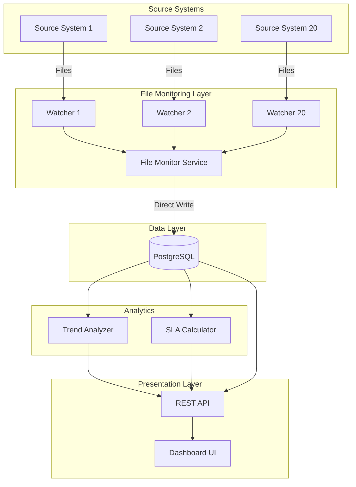

# Design Document: Intelligent Source Files Monitoring System (Simplified)

## Overview

The Intelligent Source Files Monitoring System is a **cost-effective, simplified** monitoring platform that tracks file arrivals from 20 source systems and provides trend analysis through an interactive dashboard. The system uses **PostgreSQL as the single database** for all data storage needs, eliminating expensive managed services.

### Key Design Principles

- **Simplicity First**: Single database (PostgreSQL) for all data
- **Cost-Effective**: No expensive managed services (InfluxDB, Redis, RabbitMQ)
- **Direct Processing**: File detection → immediate database write (no message queue)
- **Scalability**: PostgreSQL can handle time-series data efficiently with proper indexing
- **Easy Maintenance**: Fewer components = easier to manage and debug

## Simplified Architecture

### High-Level Architecture



### Component Interaction Flow

1. **File Arrival**: Source systems deposit files in monitored directories
2. **Detection**: File watchers detect new files
3. **Direct Storage**: File metadata written directly to PostgreSQL (no queue)
4. **Analysis**: Trend analyzer and SLA calculator query PostgreSQL
5. **Visualization**: Dashboard queries API to display data

## Components and Interfaces

### 1. File Monitor Service

**Responsibility**: Detect file arrivals and write directly to PostgreSQL.

**Key Components**:
- `DirectoryWatcher`: Monitors individual directories using OS-level file system events
- `DatabaseWriter`: Writes file arrival data directly to PostgreSQL
- `ConfigurationManager`: Manages directory-to-source-system mappings

**Interfaces**:

```python
class DirectoryWatcher:
    def __init__(self, directory_path: str, source_system_id: str):
        """Initialize watcher for a specific directory"""
        
    def start_monitoring(self) -> None:
        """Begin monitoring the directory for file arrivals"""
        
    def on_file_created(self, file_path: str) -> None:
        """Handle file creation - write directly to database"""

class FileArrivalEvent:
    source_system_id: str
    filename: str
    file_path: str
    arrival_timestamp: datetime
    file_size_bytes: int
    checksum: str
```

**Technology Choices**:
- Python `watchdog` library for cross-platform file system monitoring
- Direct PostgreSQL connection (no message queue)
- Event detection latency: < 1 second

### 2. PostgreSQL Database (Single Database for Everything)

**Responsibility**: Store ALL data - configuration, file arrivals, SLA definitions, violations, and trends.

**Schema**:

```sql
-- Source systems configuration
CREATE TABLE source_systems (
    id VARCHAR(50) PRIMARY KEY,
    name VARCHAR(255) NOT NULL,
    directory_path VARCHAR(500) NOT NULL,
    is_active BOOLEAN DEFAULT true,
    created_at TIMESTAMP DEFAULT CURRENT_TIMESTAMP,
    updated_at TIMESTAMP DEFAULT CURRENT_TIMESTAMP
);

-- File arrivals (replaces InfluxDB time-series data)
CREATE TABLE file_arrivals (
    id SERIAL PRIMARY KEY,
    source_system_id VARCHAR(50) REFERENCES source_systems(id),
    filename VARCHAR(500) NOT NULL,
    file_path VARCHAR(1000) NOT NULL,
    arrival_timestamp TIMESTAMP NOT NULL,
    file_size_bytes BIGINT NOT NULL CHECK (file_size_bytes >= 0),
    checksum VARCHAR(64),
    processed_at TIMESTAMP DEFAULT CURRENT_TIMESTAMP,
    
    -- Indexes for time-series queries
    INDEX idx_arrivals_timestamp (arrival_timestamp),
    INDEX idx_arrivals_source_time (source_system_id, arrival_timestamp),
    INDEX idx_arrivals_date (DATE(arrival_timestamp))
);

-- Daily aggregates (materialized view for dashboard performance)
CREATE MATERIALIZED VIEW daily_file_counts AS
SELECT 
    source_system_id,
    DATE(arrival_timestamp) as arrival_date,
    COUNT(*) as file_count,
    SUM(file_size_bytes) as total_size_bytes,
    MIN(arrival_timestamp) as first_arrival,
    MAX(arrival_timestamp) as last_arrival
FROM file_arrivals
GROUP BY source_system_id, DATE(arrival_timestamp);

-- Index on materialized view
CREATE INDEX idx_daily_counts_source_date ON daily_file_counts(source_system_id, arrival_date);

-- Refresh materialized view (run periodically or on-demand)
-- REFRESH MATERIALIZED VIEW CONCURRENTLY daily_file_counts;

-- SLA definitions
CREATE TABLE sla_definitions (
    id SERIAL PRIMARY KEY,
    source_system_id VARCHAR(50) REFERENCES source_systems(id),
    expected_arrival_time TIME NOT NULL,
    expected_arrival_window_minutes INT NOT NULL CHECK (expected_arrival_window_minutes > 0),
    minimum_files_per_day INT NOT NULL CHECK (minimum_files_per_day >= 0),
    weight DECIMAL(3,2) DEFAULT 1.0 CHECK (weight >= 0 AND weight <= 1),
    effective_from DATE NOT NULL,
    effective_to DATE,
    created_at TIMESTAMP DEFAULT CURRENT_TIMESTAMP
);

-- SLA violations
CREATE TABLE sla_violations (
    id SERIAL PRIMARY KEY,
    source_system_id VARCHAR(50) REFERENCES source_systems(id),
    violation_date DATE NOT NULL,
    violation_type VARCHAR(50) NOT NULL,
    expected_value VARCHAR(100),
    actual_value VARCHAR(100),
    severity VARCHAR(20) NOT NULL CHECK (severity IN ('low', 'medium', 'high', 'critical')),
    created_at TIMESTAMP DEFAULT CURRENT_TIMESTAMP,
    
    INDEX idx_violations_date (violation_date),
    INDEX idx_violations_source_date (source_system_id, violation_date)
);

-- SLA scores (cached calculations)
CREATE TABLE sla_scores (
    id SERIAL PRIMARY KEY,
    source_system_id VARCHAR(50) REFERENCES source_systems(id),
    score_date DATE NOT NULL,
    score DECIMAL(5,2) NOT NULL CHECK (score >= 0 AND score <= 100),
    total_checks INT NOT NULL,
    passed_checks INT NOT NULL,
    calculated_at TIMESTAMP DEFAULT CURRENT_TIMESTAMP,
    
    UNIQUE(source_system_id, score_date),
    INDEX idx_scores_source_date (source_system_id, score_date)
);

-- Configuration audit log
CREATE TABLE configuration_audit (
    id SERIAL PRIMARY KEY,
    user_id VARCHAR(100),
    action VARCHAR(50) NOT NULL,
    entity_type VARCHAR(50) NOT NULL,
    entity_id VARCHAR(100),
    old_value TEXT,
    new_value TEXT,
    timestamp TIMESTAMP DEFAULT CURRENT_TIMESTAMP,
    
    INDEX idx_audit_timestamp (timestamp)
);

-- Dashboard cache (replaces Redis)
CREATE TABLE dashboard_cache (
    cache_key VARCHAR(255) PRIMARY KEY,
    cache_value JSONB NOT NULL,
    expires_at TIMESTAMP NOT NULL,
    created_at TIMESTAMP DEFAULT CURRENT_TIMESTAMP
);

-- Index for cache expiration cleanup
CREATE INDEX idx_cache_expires ON dashboard_cache(expires_at);

-- Function to clean expired cache entries
CREATE OR REPLACE FUNCTION clean_expired_cache() RETURNS void AS $$
BEGIN
    DELETE FROM dashboard_cache WHERE expires_at < NOW();
END;
$$ LANGUAGE plpgsql;
```

**Performance Optimizations**:
- **Partitioning**: Partition `file_arrivals` table by month for better query performance
- **Materialized Views**: Pre-calculate daily aggregates for dashboard
- **Indexes**: Proper indexes on timestamp and source_system_id columns
- **Connection Pooling**: Use connection pooling (10-20 connections)

**Optional Enhancement - TimescaleDB**:
If time-series performance becomes an issue, you can add the free TimescaleDB extension:
```sql
-- Convert file_arrivals to hypertable (TimescaleDB)
SELECT create_hypertable('file_arrivals', 'arrival_timestamp');
```

### 3. Trend Analyzer Service

**Responsibility**: Calculate moving averages and identify patterns using PostgreSQL queries.

**Key Components**:
- `MovingAverageCalculator`: Computes trends using SQL window functions
- `PatternDetector`: Identifies patterns using SQL aggregations

**Interfaces**:

```python
class TrendAnalyzer:
    def calculate_moving_average(
        self, 
        source_system_id: str, 
        window_days: int,
        end_date: date
    ) -> List[MovingAveragePoint]:
        """Calculate moving average using PostgreSQL window functions"""
        
    def get_daily_counts(
        self, 
        source_system_id: str,
        start_date: date,
        end_date: date
    ) -> List[DailyCount]:
        """Get daily file counts from materialized view"""

class MovingAveragePoint:
    date: date
    average_count: float
    std_deviation: float
```

**SQL Queries for Trends**:

```sql
-- Moving average using window functions
SELECT 
    arrival_date,
    file_count,
    AVG(file_count) OVER (
        ORDER BY arrival_date 
        ROWS BETWEEN 6 PRECEDING AND CURRENT ROW
    ) as moving_avg_7day,
    AVG(file_count) OVER (
        ORDER BY arrival_date 
        ROWS BETWEEN 29 PRECEDING AND CURRENT ROW
    ) as moving_avg_30day
FROM daily_file_counts
WHERE source_system_id = 'SYS001'
ORDER BY arrival_date;

-- Daily counts with comparison to previous day
SELECT 
    arrival_date,
    file_count,
    LAG(file_count, 1) OVER (ORDER BY arrival_date) as previous_day_count,
    file_count - LAG(file_count, 1) OVER (ORDER BY arrival_date) as change
FROM daily_file_counts
WHERE source_system_id = 'SYS001';

-- Weekly patterns
SELECT 
    EXTRACT(DOW FROM arrival_timestamp) as day_of_week,
    EXTRACT(HOUR FROM arrival_timestamp) as hour_of_day,
    COUNT(*) as file_count,
    AVG(file_size_bytes) as avg_size
FROM file_arrivals
WHERE source_system_id = 'SYS001'
  AND arrival_timestamp >= NOW() - INTERVAL '90 days'
GROUP BY day_of_week, hour_of_day
ORDER BY day_of_week, hour_of_day;
```

### 4. SLA Calculator Service

**Responsibility**: Calculate SLA scores and track violations.

**Key Components**:
- `SLAEvaluator`: Evaluates file arrivals against SLA definitions
- `ScoreCalculator`: Computes daily and monthly SLA scores
- `ViolationTracker`: Records and categorizes SLA violations

**Interfaces**:

```python
class SLACalculator:
    def evaluate_sla_compliance(
        self, 
        source_system_id: str,
        evaluation_date: date
    ) -> SLAEvaluationResult:
        """Evaluate SLA compliance for a specific date"""
        
    def calculate_daily_score(
        self, 
        source_system_id: str,
        date: date
    ) -> float:
        """Calculate SLA score for a single day (0-100)"""
        
    def record_violation(
        self, 
        violation: SLAViolation
    ) -> bool:
        """Record an SLA violation to database"""
```

**Scoring Algorithm**:
```
Daily Score = 100 * (1 - weighted_violations / total_checks)
Monthly Score = AVG(daily_scores)
```

### 5. REST API Service

**Responsibility**: Provide unified API for dashboard.

**Key Endpoints**:

```python
# File arrivals
GET /api/v1/arrivals
  Query params: source_system_id, start_date, end_date, limit
  Returns: List of file arrivals

GET /api/v1/arrivals/summary
  Query params: date, source_system_id
  Returns: Aggregated counts by date (from materialized view)

# Trends
GET /api/v1/trends/{source_system_id}
  Query params: window_days, start_date, end_date
  Returns: Trend data with moving averages

# SLA management
GET /api/v1/sla/scores
  Query params: source_system_id, start_date, end_date
  Returns: SLA scores by date

GET /api/v1/sla/violations
  Query params: source_system_id, severity, start_date, end_date
  Returns: List of SLA violations

# Configuration
GET /api/v1/config/source-systems
  Returns: List of configured source systems

POST /api/v1/config/source-systems
  Body: Source system configuration
  Returns: Created source system

# Health
GET /api/v1/health
  Returns: System health status
```

**Technology Choices**:
- FastAPI (Python) for REST API
- JWT for authentication
- Connection pooling to PostgreSQL
- Simple in-memory caching for frequently accessed data

### 6. Dashboard UI

**Responsibility**: Provide interactive visualization.

**Key Views**:

1. **Overview Dashboard**
   - Total files received today
   - SLA score summary (all systems)
   - Recent file arrivals timeline

2. **Source System Detail View**
   - File arrival chart (daily/weekly/monthly)
   - Trend lines with moving averages
   - SLA compliance status

3. **SLA Management View**
   - SLA score heatmap (systems × dates)
   - Violation details table
   - SLA definition editor

4. **Configuration View**
   - Source system management
   - Directory monitoring setup

**Technology Choices**:
- React or Vue.js for frontend
- Chart.js for visualizations
- Responsive design

## Data Flow

### File Arrival Flow (Simplified)

```
1. File created in monitored directory
   ↓
2. DirectoryWatcher detects file (< 1 second)
   ↓
3. Extract metadata (filename, size, checksum, timestamp)
   ↓
4. Write directly to PostgreSQL file_arrivals table
   ↓
5. Dashboard queries PostgreSQL for display
```

**No message queue = Simpler, faster, fewer failure points**

### Dashboard Query Flow

```
1. User opens dashboard
   ↓
2. API queries PostgreSQL
   ↓
3. Use materialized view for aggregated data (fast)
   ↓
4. Return JSON to frontend
   ↓
5. Render charts
```

**Materialized views = Fast dashboard without Redis cache**

## Cost Comparison

### Before (Expensive)
- InfluxDB Cloud: $50-200/month
- Redis ElastiCache: $30-100/month
- RabbitMQ Amazon MQ: $50-150/month
- PostgreSQL RDS: $50-150/month
- **Total: $180-600/month**

### After (Cost-Effective)
- PostgreSQL RDS: $50-150/month (or free if self-hosted)
- **Total: $50-150/month (or $0 if self-hosted)**

**Savings: $130-450/month (70-90% reduction)**

## Performance Considerations

### PostgreSQL as Time-Series Database

**Why PostgreSQL works for time-series data:**
1. **Proper Indexing**: B-tree indexes on timestamp columns are very efficient
2. **Partitioning**: Monthly partitions keep query performance fast
3. **Materialized Views**: Pre-calculated aggregates for dashboard
4. **Window Functions**: Built-in support for moving averages and trends
5. **JSONB**: Flexible storage for metadata
6. **Proven Scale**: PostgreSQL handles billions of rows efficiently

**Performance Targets**:
- File detection to database write: < 2 seconds
- Dashboard query response: < 500ms (using materialized views)
- Trend calculation: < 1 second for 90-day window
- Support for 20 source systems with 1000+ files/day each

### Optimization Strategies

1. **Table Partitioning**:
```sql
-- Partition file_arrivals by month
CREATE TABLE file_arrivals_2024_01 PARTITION OF file_arrivals
    FOR VALUES FROM ('2024-01-01') TO ('2024-02-01');
```

2. **Materialized View Refresh**:
```sql
-- Refresh daily (scheduled job)
REFRESH MATERIALIZED VIEW CONCURRENTLY daily_file_counts;
```

3. **Connection Pooling**:
```python
# Use connection pooling
from sqlalchemy import create_engine
engine = create_engine(
    'postgresql://...',
    pool_size=10,
    max_overflow=20
)
```

4. **Query Optimization**:
- Use EXPLAIN ANALYZE to optimize slow queries
- Add indexes based on actual query patterns
- Use LIMIT for pagination

## Implementation Notes

### Technology Stack Summary

- **File Monitoring**: Python with watchdog library
- **Database**: PostgreSQL (single database for everything)
- **API**: FastAPI (Python)
- **Frontend**: React with Chart.js
- **Containerization**: Docker + Docker Compose
- **Monitoring**: PostgreSQL built-in stats + simple logging

### Deployment Architecture

**Development**:
- Docker Compose with PostgreSQL container
- Hot reload for rapid iteration

**Production**:
- PostgreSQL RDS (or self-hosted on EC2)
- Python application on EC2 or container service
- Simple, easy to maintain

### Monitoring

**Metrics to Track**:
- File detection latency
- Database query performance
- API response times
- Disk usage

**Simple Monitoring**:
- PostgreSQL built-in statistics
- Application logs
- Simple health check endpoint

## Migration from Complex Architecture

If you already have InfluxDB, Redis, or RabbitMQ:

1. **Stop using message queue**: Write directly to PostgreSQL
2. **Migrate InfluxDB data**: Export and import to PostgreSQL file_arrivals table
3. **Remove Redis**: Use PostgreSQL materialized views and simple in-memory cache
4. **Update code**: Remove dependencies on influxdb-client, redis, pika libraries
5. **Simplify deployment**: Remove unnecessary containers from docker-compose.yml

## Summary

This simplified architecture:
- ✅ **Reduces costs by 70-90%**
- ✅ **Easier to maintain** (one database instead of four services)
- ✅ **Simpler deployment** (fewer moving parts)
- ✅ **Still scalable** (PostgreSQL handles millions of rows)
- ✅ **All features preserved** (monitoring, trends, SLA tracking, dashboard)
- ✅ **Better reliability** (fewer failure points)

**PostgreSQL is powerful enough to handle everything!**
