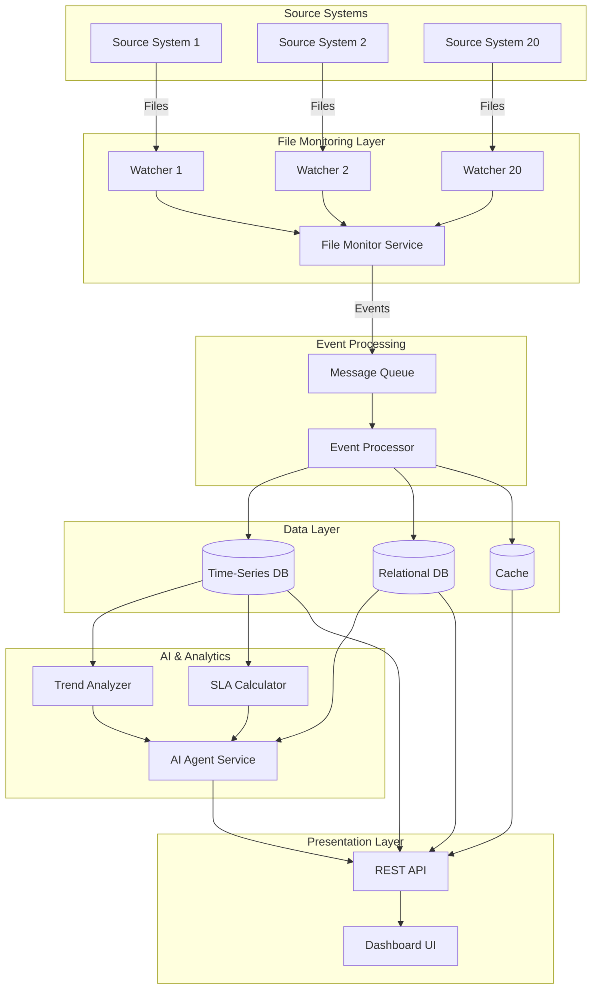

# Design Document: Intelligent Source Files Monitoring System

## Overview

The Intelligent Source Files Monitoring System is a distributed monitoring platform that tracks file arrivals from 20 source systems, analyzes patterns using AI, and provides comprehensive SLA management through an interactive dashboard. The system employs a microservices architecture with event-driven communication, time-series data storage, and an AI agent for intelligent insights.

### Key Design Principles

- **Event-Driven Architecture**: File arrivals trigger events that flow through the system
- **Scalability**: Support for monitoring additional source systems without architectural changes
- **Real-Time Processing**: Sub-minute latency from file arrival to dashboard visibility
- **AI-Powered Intelligence**: Proactive anomaly detection and predictive analytics
- **Separation of Concerns**: Independent services for monitoring, storage, analysis, and visualization

## Architecture

### High-Level Architecture



### Component Interaction Flow

1. **File Arrival**: Source systems deposit files in monitored directories
2. **Detection**: File watchers detect new files and emit events
3. **Event Processing**: Events are queued and processed to extract metadata
4. **Storage**: Timestamp and metadata are persisted to databases
5. **Analysis**: AI agent and analyzers process data for insights
6. **Visualization**: Dashboard queries APIs to display real-time data

## Components and Interfaces

### 1. File Monitor Service

**Responsibility**: Detect file arrivals across all monitored directories and emit events.

**Key Components**:
- `DirectoryWatcher`: Monitors individual directories using OS-level file system events
- `FileEventEmitter`: Publishes file arrival events to message queue
- `ConfigurationManager`: Manages directory-to-source-system mappings

**Interfaces**:

```python
class DirectoryWatcher:
    def __init__(self, directory_path: str, source_system_id: str):
        """Initialize watcher for a specific directory"""
        
    def start_monitoring(self) -> None:
        """Begin monitoring the directory for file arrivals"""
        
    def stop_monitoring(self) -> None:
        """Stop monitoring the directory"""
        
    def on_file_created(self, file_path: str) -> FileArrivalEvent:
        """Handle file creation event and return structured event"""

class FileArrivalEvent:
    source_system_id: str
    filename: str
    file_path: str
    arrival_timestamp: datetime
    file_size_bytes: int
    checksum: str
```

**Technology Choices**:
- Python `watchdog` library for cross-platform file system monitoring
- Inotify (Linux) / FSEvents (macOS) / ReadDirectoryChangesW (Windows) for OS-level events
- Event detection latency: < 1 second

### 2. Message Queue

**Responsibility**: Decouple file detection from processing, provide buffering and reliability.

**Key Features**:
- At-least-once delivery guarantee
- Message persistence for durability
- Support for multiple consumers

**Technology Choices**:
- Apache Kafka or RabbitMQ for message queuing
- Topic: `file-arrivals`
- Partition by source_system_id for ordered processing per source

### 3. Event Processor Service

**Responsibility**: Consume file arrival events and persist data to databases.

**Key Components**:
- `EventConsumer`: Reads events from message queue
- `TimestampRecorder`: Writes timestamp data to time-series database
- `MetadataRecorder`: Writes file metadata to relational database
- `CacheUpdater`: Updates cache with latest arrival information

**Interfaces**:

```python
class EventProcessor:
    def process_event(self, event: FileArrivalEvent) -> ProcessingResult:
        """Process a single file arrival event"""
        
    def record_timestamp(self, event: FileArrivalEvent) -> bool:
        """Record timestamp in time-series database"""
        
    def record_metadata(self, event: FileArrivalEvent) -> bool:
        """Record metadata in relational database"""
        
    def update_cache(self, event: FileArrivalEvent) -> bool:
        """Update cache with latest information"""

class ProcessingResult:
    success: bool
    timestamp_recorded: bool
    metadata_recorded: bool
    cache_updated: bool
    error_message: Optional[str]
```

### 4. Time-Series Database

**Responsibility**: Store timestamp data optimized for time-based queries and aggregations.

**Schema**:

```sql
-- Time-series measurement
measurement: file_arrivals
tags:
  - source_system_id
  - filename_pattern (derived from filename)
fields:
  - file_size_bytes
  - processing_duration_ms
timestamp: arrival_timestamp (nanosecond precision)
```

**Technology Choices**:
- InfluxDB or TimescaleDB for time-series data
- Retention policy: 90 days for raw data, aggregates retained indefinitely
- Downsampling: 1-hour aggregates after 30 days

### 5. Relational Database

**Responsibility**: Store configuration, SLA definitions, and detailed metadata.

**Schema**:

```sql
-- Source systems configuration
CREATE TABLE source_systems (
    id VARCHAR(50) PRIMARY KEY,
    name VARCHAR(255) NOT NULL,
    directory_path VARCHAR(500) NOT NULL,
    is_active BOOLEAN DEFAULT true,
    created_at TIMESTAMP DEFAULT CURRENT_TIMESTAMP
);

-- SLA definitions
CREATE TABLE sla_definitions (
    id SERIAL PRIMARY KEY,
    source_system_id VARCHAR(50) REFERENCES source_systems(id),
    expected_arrival_time TIME,
    expected_arrival_window_minutes INT,
    minimum_files_per_day INT,
    weight DECIMAL(3,2) DEFAULT 1.0,
    effective_from DATE,
    effective_to DATE
);

-- SLA violations
CREATE TABLE sla_violations (
    id SERIAL PRIMARY KEY,
    source_system_id VARCHAR(50) REFERENCES source_systems(id),
    violation_date DATE,
    violation_type VARCHAR(50),
    expected_value VARCHAR(100),
    actual_value VARCHAR(100),
    severity VARCHAR(20),
    created_at TIMESTAMP DEFAULT CURRENT_TIMESTAMP
);

-- File arrival details
CREATE TABLE file_arrivals (
    id SERIAL PRIMARY KEY,
    source_system_id VARCHAR(50) REFERENCES source_systems(id),
    filename VARCHAR(500),
    file_path VARCHAR(1000),
    arrival_timestamp TIMESTAMP,
    file_size_bytes BIGINT,
    checksum VARCHAR(64),
    processed_at TIMESTAMP DEFAULT CURRENT_TIMESTAMP,
    INDEX idx_arrival_timestamp (arrival_timestamp),
    INDEX idx_source_system (source_system_id, arrival_timestamp)
);

-- Configuration audit log
CREATE TABLE configuration_audit (
    id SERIAL PRIMARY KEY,
    user_id VARCHAR(100),
    action VARCHAR(50),
    entity_type VARCHAR(50),
    entity_id VARCHAR(100),
    old_value TEXT,
    new_value TEXT,
    timestamp TIMESTAMP DEFAULT CURRENT_TIMESTAMP
);
```

**Technology Choices**:
- PostgreSQL for relational data
- Indexes on timestamp and source_system_id for query performance

### 6. Cache Layer

**Responsibility**: Provide fast access to frequently queried data and reduce database load.

**Cached Data**:
- Latest file arrival per source system
- Current SLA scores
- Active alerts and anomalies
- Dashboard summary statistics

**Technology Choices**:
- Redis for in-memory caching
- TTL: 60 seconds for dashboard data
- Cache invalidation on new file arrivals

### 7. Trend Analyzer Service

**Responsibility**: Calculate moving averages, identify patterns, and generate forecasts.

**Key Components**:
- `MovingAverageCalculator`: Computes 7-day, 30-day, 90-day moving averages
- `SeasonalityDetector`: Identifies weekly and monthly patterns
- `ForecastEngine`: Predicts expected file arrivals

**Interfaces**:

```python
class TrendAnalyzer:
    def calculate_moving_average(
        self, 
        source_system_id: str, 
        window_days: int,
        end_date: date
    ) -> List[MovingAveragePoint]:
        """Calculate moving average for specified window"""
        
    def detect_seasonality(
        self, 
        source_system_id: str,
        lookback_days: int
    ) -> SeasonalityPattern:
        """Identify recurring patterns in file arrivals"""
        
    def forecast_arrivals(
        self, 
        source_system_id: str,
        forecast_days: int
    ) -> List[ForecastPoint]:
        """Generate forecast for future file arrivals"""

class MovingAveragePoint:
    date: date
    average_count: float
    std_deviation: float

class SeasonalityPattern:
    pattern_type: str  # 'daily', 'weekly', 'monthly'
    confidence: float
    peak_times: List[time]
    low_times: List[time]

class ForecastPoint:
    date: date
    predicted_count: int
    confidence_interval_lower: int
    confidence_interval_upper: int
```

**Algorithms**:
- Simple Moving Average (SMA) for trend lines
- Exponential Smoothing for forecasting
- Z-score analysis for anomaly detection

### 8. SLA Calculator Service

**Responsibility**: Calculate SLA scores and track violations.

**Key Components**:
- `SLAEvaluator`: Evaluates file arrivals against SLA definitions
- `ScoreCalculator`: Computes daily and monthly SLA scores
- `ViolationTracker`: Records and categorizes SLA violations

**Interfaces**:

```python
class SLACalculator:
    def evaluate_sla_compliance(
        self, 
        source_system_id: str,
        evaluation_date: date
    ) -> SLAEvaluationResult:
        """Evaluate SLA compliance for a specific date"""
        
    def calculate_daily_score(
        self, 
        source_system_id: str,
        date: date
    ) -> float:
        """Calculate SLA score for a single day (0-100)"""
        
    def calculate_monthly_score(
        self, 
        month: date
    ) -> Dict[str, float]:
        """Calculate aggregate monthly scores for all source systems"""
        
    def record_violation(
        self, 
        violation: SLAViolation
    ) -> bool:
        """Record an SLA violation"""

class SLAEvaluationResult:
    source_system_id: str
    evaluation_date: date
    is_compliant: bool
    violations: List[SLAViolation]
    score: float

class SLAViolation:
    source_system_id: str
    violation_type: str  # 'missing_file', 'late_arrival', 'insufficient_count'
    expected_value: str
    actual_value: str
    severity: str  # 'low', 'medium', 'high', 'critical'
    timestamp: datetime
```

**Scoring Algorithm**:
```
Daily Score = 100 * (1 - weighted_violations / total_checks)
Monthly Score = weighted_average(daily_scores, recency_weight)

where:
  recency_weight = exponential decay favoring recent days
  weighted_violations = sum(violation_severity_weights)
```

### 9. AI Agent Service

**Responsibility**: Provide intelligent insights, anomaly detection, and recommendations using AI.

**Key Components**:
- `PatternRecognizer`: Identifies recurring issues and patterns
- `AnomalyDetector`: Detects unusual behavior in file arrivals
- `InsightGenerator`: Creates natural language summaries and recommendations
- `PredictiveModel`: Predicts future SLA violations

**Interfaces**:

```python
class AIAgent:
    def analyze_patterns(
        self, 
        source_system_id: Optional[str],
        lookback_days: int
    ) -> List[Pattern]:
        """Analyze historical data to identify patterns"""
        
    def detect_anomalies(
        self, 
        source_system_id: str,
        detection_window_hours: int
    ) -> List[Anomaly]:
        """Detect anomalies in recent file arrivals"""
        
    def generate_insights(
        self, 
        context: AnalysisContext
    ) -> List[Insight]:
        """Generate natural language insights"""
        
    def predict_sla_violations(
        self, 
        forecast_days: int
    ) -> List[PredictedViolation]:
        """Predict potential SLA violations"""
        
    def recommend_actions(
        self, 
        issue: Issue
    ) -> List[Recommendation]:
        """Generate actionable recommendations"""

class Pattern:
    pattern_id: str
    pattern_type: str
    description: str
    frequency: str
    affected_systems: List[str]
    confidence: float

class Anomaly:
    anomaly_id: str
    source_system_id: str
    anomaly_type: str  # 'missing_file', 'volume_spike', 'timing_shift'
    detected_at: datetime
    severity: str
    description: str
    expected_behavior: str
    actual_behavior: str

class Insight:
    insight_id: str
    category: str  # 'health', 'trend', 'risk', 'opportunity'
    title: str
    description: str
    affected_systems: List[str]
    priority: str
    generated_at: datetime

class PredictedViolation:
    source_system_id: str
    predicted_date: date
    violation_type: str
    probability: float
    contributing_factors: List[str]

class Recommendation:
    recommendation_id: str
    title: str
    description: str
    action_items: List[str]
    expected_impact: str
    priority: str
```

**AI Capabilities**:
- **Anomaly Detection**: Statistical methods (Z-score, IQR) combined with ML models
- **Pattern Recognition**: Time-series clustering and sequence mining
- **Natural Language Generation**: Template-based generation with dynamic content
- **Predictive Analytics**: ARIMA or Prophet models for time-series forecasting
- **Learning**: Feedback loop to improve predictions based on actual outcomes

**Technology Choices**:
- Python scikit-learn for statistical analysis
- Prophet or statsmodels for time-series forecasting
- LangChain or similar for LLM integration (optional for NLG)
- Model retraining: Weekly batch process

### 10. REST API Service

**Responsibility**: Provide unified API for dashboard and external integrations.

**Key Endpoints**:

```python
# File arrivals
GET /api/v1/arrivals
  Query params: source_system_id, start_date, end_date, limit
  Returns: List of file arrivals with timestamps

GET /api/v1/arrivals/summary
  Query params: date, source_system_id
  Returns: Aggregated counts by date and source

# Trends and analytics
GET /api/v1/trends/{source_system_id}
  Query params: window_days, metric_type
  Returns: Trend data with moving averages

GET /api/v1/forecast/{source_system_id}
  Query params: forecast_days
  Returns: Predicted file arrival counts

# SLA management
GET /api/v1/sla/scores
  Query params: source_system_id, start_date, end_date
  Returns: SLA scores by date

GET /api/v1/sla/violations
  Query params: source_system_id, severity, start_date, end_date
  Returns: List of SLA violations

POST /api/v1/sla/definitions
  Body: SLA definition JSON
  Returns: Created SLA definition

# AI insights
GET /api/v1/insights
  Query params: category, priority, limit
  Returns: AI-generated insights

GET /api/v1/anomalies
  Query params: source_system_id, severity, hours
  Returns: Detected anomalies

# Configuration
GET /api/v1/config/source-systems
  Returns: List of configured source systems

POST /api/v1/config/source-systems
  Body: Source system configuration
  Returns: Created source system

PUT /api/v1/config/source-systems/{id}
  Body: Updated configuration
  Returns: Updated source system

# Health and status
GET /api/v1/health
  Returns: System health status

GET /api/v1/metrics
  Returns: System performance metrics
```

**Technology Choices**:
- FastAPI (Python) or Express (Node.js) for REST API
- JWT for authentication
- Rate limiting: 1000 requests/minute per user
- Response caching for expensive queries

### 11. Dashboard UI

**Responsibility**: Provide interactive visualization and user interface.

**Key Views**:

1. **Overview Dashboard**
   - Total files received today
   - Active alerts and anomalies
   - SLA score summary (all systems)
   - Recent file arrivals timeline

2. **Source System Detail View**
   - File arrival chart (daily/weekly/monthly)
   - Trend lines with moving averages
   - SLA compliance status
   - Historical violations

3. **Trends and Analytics View**
   - Multi-system comparison charts
   - Seasonality patterns
   - Forecast visualizations
   - Pattern analysis results

4. **SLA Management View**
   - SLA score heatmap (systems × dates)
   - Violation details table
   - SLA definition editor
   - Compliance reports

5. **AI Insights View**
   - Generated insights feed
   - Anomaly alerts
   - Recommendations panel
   - Predicted violations

6. **Configuration View**
   - Source system management
   - Directory monitoring setup
   - SLA threshold configuration
   - User and role management

**Technology Choices**:
- React or Vue.js for frontend framework
- Chart.js or D3.js for visualizations
- WebSocket for real-time updates
- Responsive design for mobile access

## Data Models

### Core Data Structures

```python
# File arrival event (in-memory)
@dataclass
class FileArrivalEvent:
    event_id: str
    source_system_id: str
    filename: str
    file_path: str
    arrival_timestamp: datetime
    file_size_bytes: int
    checksum: str
    metadata: Dict[str, Any]

# Source system configuration
@dataclass
class SourceSystem:
    id: str
    name: str
    directory_path: str
    is_active: bool
    sla_definitions: List[SLADefinition]
    created_at: datetime
    updated_at: datetime

# SLA definition
@dataclass
class SLADefinition:
    id: int
    source_system_id: str
    expected_arrival_time: time
    expected_arrival_window_minutes: int
    minimum_files_per_day: int
    weight: float
    effective_from: date
    effective_to: Optional[date]

# Time-series data point
@dataclass
class ArrivalDataPoint:
    timestamp: datetime
    source_system_id: str
    file_count: int
    total_size_bytes: int
    avg_processing_time_ms: float

# SLA score
@dataclass
class SLAScore:
    source_system_id: str
    date: date
    score: float  # 0-100
    total_checks: int
    passed_checks: int
    violations: List[SLAViolation]
```

## Correctness Properties

*A property is a characteristic or behavior that should hold true across all valid executions of a system—essentially, a formal statement about what the system should do. Properties serve as the bridge between human-readable specifications and machine-verifiable correctness guarantees.*


### Property 1: Timestamp Precision and Accuracy

*For any* file arrival event, the recorded timestamp should have millisecond precision and be within 100ms of the actual file creation time.

**Validates: Requirements 1.3**

### Property 2: Source System Association Correctness

*For any* file detected in a monitored directory, the associated source system ID should match the configured directory-to-source-system mapping.

**Validates: Requirements 1.4**

### Property 3: Independent Concurrent Processing

*For any* set of files arriving simultaneously in different directories, each file should generate an independent event with unique event IDs and correct metadata.

**Validates: Requirements 1.5**

### Property 4: Complete Data Persistence

*For any* file arrival event, the database record should contain all required fields (source_system_id, filename, arrival_timestamp, file_size_bytes) and match the event data exactly.

**Validates: Requirements 2.1, 2.2**

### Property 5: Concurrent Write Integrity

*For any* set of concurrent file arrival events, all events should be persisted to the database without data loss, corruption, or race conditions.

**Validates: Requirements 2.3**

### Property 6: No Duplicate Entries

*For any* file arrival event processed multiple times (idempotency test), exactly one database record should exist for that event.

**Validates: Requirements 2.5**

### Property 7: Aggregation Correctness

*For any* set of file arrivals, the dashboard's aggregated counts by date should equal the sum of individual file arrivals for each date.

**Validates: Requirements 3.1**

### Property 8: Filter Correctness

*For any* combination of source system and date range filters applied, the returned data should contain only records matching all filter criteria.

**Validates: Requirements 3.2, 3.3**

### Property 9: Moving Average Calculation Correctness

*For any* time series of file arrival counts and any window size (7, 30, or 90 days), the calculated moving average at each point should equal the arithmetic mean of the window values.

**Validates: Requirements 4.1**

### Property 10: Anomaly Alert Generation

*For any* detected anomaly, an alert should be generated containing the anomaly type, affected source system, severity, and contextual description.

**Validates: Requirements 4.4**

### Property 11: SLA Violation Detection

*For any* file arrival that occurs outside the configured SLA window or violates minimum frequency requirements, an SLA violation record should be created with correct violation type and details.

**Validates: Requirements 5.3**

### Property 12: SLA Compliance Status Accuracy

*For any* source system and date, the displayed compliance status should accurately reflect whether all SLA criteria were met based on actual file arrivals.

**Validates: Requirements 5.4**

### Property 13: SLA Score Calculation Correctness

*For any* set of SLA checks and violations, the calculated score should equal 100 * (1 - weighted_violations / total_checks) and be within the range [0, 100].

**Validates: Requirements 6.1, 6.2, 6.3**

### Property 14: Recency Weighting in Scores

*For any* two violations with the same severity but different dates, the more recent violation should contribute more weight to the SLA score calculation.

**Validates: Requirements 6.4**

### Property 15: Recommendation Generation for Predictions

*For any* predicted SLA violation, the AI agent should generate at least one actionable recommendation with description and expected impact.

**Validates: Requirements 7.3**

### Property 16: Configuration Update Correctness

*For any* configuration change (add/remove directory, update SLA parameters), the new configuration should be immediately retrievable and match the updated values exactly.

**Validates: Requirements 8.1, 8.2**

### Property 17: Configuration Validation

*For any* invalid configuration (e.g., negative SLA window, non-existent directory path), the system should reject the change and return a descriptive error message.

**Validates: Requirements 8.4**

### Property 18: Audit Log Completeness

*For any* configuration change or administrative action, an audit log entry should exist containing user ID, action type, entity details, old value, new value, and timestamp.

**Validates: Requirements 8.5, 10.4**

### Property 19: Data Archival Integrity

*For any* data archived due to retention policy, retrieving and comparing it to the original should show no data loss or corruption (round-trip property).

**Validates: Requirements 9.5**

### Property 20: Aggregate Preservation After Archival

*For any* date range where detailed data has been archived, the aggregate statistics (daily counts, averages) should remain available and unchanged.

**Validates: Requirements 9.3**

### Property 21: Authentication Enforcement

*For any* unauthenticated request to protected endpoints, the system should return a 401 Unauthorized response and deny access.

**Validates: Requirements 10.1**

### Property 22: Role-Based Authorization

*For any* user action requiring specific permissions, the action should succeed only if the user's role includes the required permission.

**Validates: Requirements 10.2**

### Property 23: Unauthorized Access Handling

*For any* unauthorized access attempt, the system should deny access, return a 403 Forbidden response, and generate a security alert in the audit log.

**Validates: Requirements 10.5**

## Error Handling

### Error Categories

1. **File System Errors**
   - Directory not accessible
   - Permission denied
   - Disk full
   - File locked or in use

2. **Database Errors**
   - Connection failures
   - Query timeouts
   - Constraint violations
   - Transaction deadlocks

3. **Message Queue Errors**
   - Queue unavailable
   - Message delivery failures
   - Consumer lag exceeding threshold

4. **AI/Analytics Errors**
   - Model inference failures
   - Insufficient data for analysis
   - Forecast generation errors

5. **Configuration Errors**
   - Invalid configuration values
   - Missing required parameters
   - Conflicting settings

6. **Authentication/Authorization Errors**
   - Invalid credentials
   - Expired tokens
   - Insufficient permissions

### Error Handling Strategies

**File Monitor Service**:
```python
class FileMonitorErrorHandler:
    def handle_directory_error(self, error: DirectoryError) -> None:
        """
        - Log error with full context
        - Mark directory as temporarily unavailable
        - Send alert to administrators
        - Retry with exponential backoff (max 5 attempts)
        - If persistent, disable monitoring for that directory
        """
        
    def handle_permission_error(self, error: PermissionError) -> None:
        """
        - Log error with directory path
        - Send critical alert (requires manual intervention)
        - Continue monitoring other directories
        """
```

**Event Processor Service**:
```python
class EventProcessorErrorHandler:
    def handle_database_error(self, error: DatabaseError, event: FileArrivalEvent) -> None:
        """
        - Log error with event details
        - Retry with exponential backoff (max 3 attempts)
        - If retry fails, write event to dead letter queue
        - Send alert if dead letter queue size exceeds threshold
        """
        
    def handle_duplicate_event(self, event: FileArrivalEvent) -> None:
        """
        - Log duplicate detection
        - Skip processing (idempotent behavior)
        - Increment duplicate counter metric
        """
```

**AI Agent Service**:
```python
class AIAgentErrorHandler:
    def handle_insufficient_data(self, error: InsufficientDataError) -> None:
        """
        - Log warning with required vs available data points
        - Return graceful degradation response
        - Suggest minimum data requirements to user
        """
        
    def handle_model_error(self, error: ModelError) -> None:
        """
        - Log error with model details and input data
        - Fall back to simpler statistical methods
        - Send alert to ML team for investigation
        """
```

**API Service**:
```python
class APIErrorHandler:
    def handle_validation_error(self, error: ValidationError) -> Response:
        """
        - Return 400 Bad Request
        - Include detailed error messages for each invalid field
        - Log validation failure
        """
        
    def handle_authentication_error(self, error: AuthError) -> Response:
        """
        - Return 401 Unauthorized
        - Log authentication attempt with IP and user agent
        - Increment failed auth counter
        - Trigger rate limiting if threshold exceeded
        """
        
    def handle_authorization_error(self, error: AuthzError) -> Response:
        """
        - Return 403 Forbidden
        - Log unauthorized access attempt
        - Generate security alert
        """
        
    def handle_internal_error(self, error: Exception) -> Response:
        """
        - Return 500 Internal Server Error
        - Log full stack trace
        - Return generic error message to client (no sensitive details)
        - Send alert to on-call team
        """
```

### Circuit Breaker Pattern

For external dependencies (database, message queue), implement circuit breaker:

```python
class CircuitBreaker:
    states = ['CLOSED', 'OPEN', 'HALF_OPEN']
    
    def __init__(self, failure_threshold: int = 5, timeout: int = 60):
        self.failure_threshold = failure_threshold
        self.timeout = timeout  # seconds
        self.failure_count = 0
        self.state = 'CLOSED'
        self.last_failure_time = None
    
    def call(self, func, *args, **kwargs):
        if self.state == 'OPEN':
            if time.time() - self.last_failure_time > self.timeout:
                self.state = 'HALF_OPEN'
            else:
                raise CircuitBreakerOpenError()
        
        try:
            result = func(*args, **kwargs)
            if self.state == 'HALF_OPEN':
                self.state = 'CLOSED'
                self.failure_count = 0
            return result
        except Exception as e:
            self.failure_count += 1
            self.last_failure_time = time.time()
            
            if self.failure_count >= self.failure_threshold:
                self.state = 'OPEN'
            
            raise e
```

### Retry Policies

**Exponential Backoff**:
- Initial delay: 1 second
- Multiplier: 2
- Max delay: 60 seconds
- Max attempts: 5

**Use Cases**:
- Database connection failures
- Message queue publish failures
- External API calls

**No Retry**:
- Validation errors
- Authentication/authorization errors
- Duplicate event detection

## Testing Strategy

### Dual Testing Approach

The system will employ both unit testing and property-based testing to ensure comprehensive coverage:

- **Unit Tests**: Verify specific examples, edge cases, error conditions, and integration points
- **Property Tests**: Verify universal properties across all inputs through randomized testing

Both approaches are complementary and necessary. Unit tests catch concrete bugs and validate specific scenarios, while property tests verify general correctness across a wide input space.

### Unit Testing

**Focus Areas**:
- Specific examples demonstrating correct behavior
- Edge cases (empty files, very large files, special characters in filenames)
- Error conditions (database failures, permission errors, invalid configurations)
- Integration points between components
- Boundary conditions (exactly at SLA threshold, retention period boundaries)

**Example Unit Tests**:
```python
def test_file_arrival_event_creation():
    """Test that FileArrivalEvent is created with correct fields"""
    event = create_file_arrival_event(
        source_system_id="SYS001",
        filename="data.csv",
        file_path="/data/sys001/data.csv",
        file_size_bytes=1024
    )
    assert event.source_system_id == "SYS001"
    assert event.filename == "data.csv"
    assert event.file_size_bytes == 1024

def test_sla_violation_at_boundary():
    """Test SLA violation detection at exact boundary"""
    sla = SLADefinition(
        expected_arrival_time=time(9, 0),
        expected_arrival_window_minutes=30
    )
    # File arrives at 9:30:01 - just outside window
    arrival_time = datetime.combine(date.today(), time(9, 30, 1))
    assert is_sla_violation(sla, arrival_time) == True

def test_empty_file_handling():
    """Test that empty files are processed correctly"""
    event = FileArrivalEvent(
        source_system_id="SYS001",
        filename="empty.txt",
        file_size_bytes=0
    )
    result = process_event(event)
    assert result.success == True
    assert result.timestamp_recorded == True
```

**Unit Test Coverage Goals**:
- Code coverage: > 80%
- Branch coverage: > 75%
- All error handling paths tested

### Property-Based Testing

**Configuration**:
- Library: Hypothesis (Python), fast-check (TypeScript), or QuickCheck (Haskell)
- Minimum iterations per test: 100
- Each test tagged with: **Feature: intelligent-file-monitoring, Property {number}: {property_text}**

**Property Test Examples**:

```python
from hypothesis import given, strategies as st
import hypothesis.strategies as st

@given(
    source_system_id=st.text(min_size=1, max_size=50),
    filename=st.text(min_size=1, max_size=255),
    file_size=st.integers(min_value=0, max_value=10**9)
)
def test_property_4_complete_data_persistence(source_system_id, filename, file_size):
    """
    Feature: intelligent-file-monitoring, Property 4: Complete Data Persistence
    
    For any file arrival event, the database record should contain all required 
    fields and match the event data exactly.
    """
    # Create event
    event = FileArrivalEvent(
        source_system_id=source_system_id,
        filename=filename,
        file_size_bytes=file_size,
        arrival_timestamp=datetime.now()
    )
    
    # Process event
    process_event(event)
    
    # Retrieve from database
    record = db.query_file_arrival(event.event_id)
    
    # Verify all fields present and correct
    assert record is not None
    assert record.source_system_id == event.source_system_id
    assert record.filename == event.filename
    assert record.file_size_bytes == event.file_size_bytes
    assert abs((record.arrival_timestamp - event.arrival_timestamp).total_seconds()) < 0.001

@given(
    arrivals=st.lists(
        st.tuples(
            st.dates(min_value=date(2020, 1, 1), max_value=date(2025, 12, 31)),
            st.integers(min_value=0, max_value=1000)
        ),
        min_size=1,
        max_size=100
    )
)
def test_property_7_aggregation_correctness(arrivals):
    """
    Feature: intelligent-file-monitoring, Property 7: Aggregation Correctness
    
    For any set of file arrivals, the dashboard's aggregated counts by date 
    should equal the sum of individual file arrivals for each date.
    """
    # Insert arrivals
    for arrival_date, count in arrivals:
        for _ in range(count):
            insert_file_arrival(arrival_date)
    
    # Get aggregated counts
    aggregated = get_aggregated_counts()
    
    # Calculate expected counts
    expected = {}
    for arrival_date, count in arrivals:
        expected[arrival_date] = expected.get(arrival_date, 0) + count
    
    # Verify aggregation
    for date_key, expected_count in expected.items():
        assert aggregated[date_key] == expected_count

@given(
    time_series=st.lists(st.integers(min_value=0, max_value=1000), min_size=30, max_size=365),
    window_size=st.sampled_from([7, 30, 90])
)
def test_property_9_moving_average_correctness(time_series, window_size):
    """
    Feature: intelligent-file-monitoring, Property 9: Moving Average Calculation Correctness
    
    For any time series and window size, the calculated moving average should 
    equal the arithmetic mean of the window values.
    """
    moving_averages = calculate_moving_average(time_series, window_size)
    
    for i in range(window_size - 1, len(time_series)):
        window = time_series[i - window_size + 1:i + 1]
        expected_avg = sum(window) / len(window)
        assert abs(moving_averages[i] - expected_avg) < 0.001

@given(
    violations=st.lists(
        st.tuples(
            st.dates(min_value=date(2024, 1, 1), max_value=date(2024, 12, 31)),
            st.floats(min_value=0.1, max_value=1.0)  # severity weight
        ),
        min_size=1,
        max_size=50
    ),
    total_checks=st.integers(min_value=1, max_value=100)
)
def test_property_13_sla_score_calculation(violations, total_checks):
    """
    Feature: intelligent-file-monitoring, Property 13: SLA Score Calculation Correctness
    
    For any set of violations and checks, the score should equal 
    100 * (1 - weighted_violations / total_checks) and be in range [0, 100].
    """
    score = calculate_sla_score(violations, total_checks)
    
    # Calculate expected score
    weighted_violations = sum(weight for _, weight in violations)
    expected_score = max(0, min(100, 100 * (1 - weighted_violations / total_checks)))
    
    # Verify score
    assert abs(score - expected_score) < 0.01
    assert 0 <= score <= 100

@given(
    config=st.fixed_dictionaries({
        'source_system_id': st.text(min_size=1, max_size=50),
        'directory_path': st.text(min_size=1, max_size=500),
        'sla_window_minutes': st.integers(min_value=1, max_value=1440)
    })
)
def test_property_16_configuration_update_correctness(config):
    """
    Feature: intelligent-file-monitoring, Property 16: Configuration Update Correctness
    
    For any configuration change, the new configuration should be immediately 
    retrievable and match the updated values exactly.
    """
    # Update configuration
    update_configuration(config)
    
    # Retrieve configuration
    retrieved = get_configuration(config['source_system_id'])
    
    # Verify all fields match
    assert retrieved['source_system_id'] == config['source_system_id']
    assert retrieved['directory_path'] == config['directory_path']
    assert retrieved['sla_window_minutes'] == config['sla_window_minutes']
```

### Integration Testing

**Test Scenarios**:
1. End-to-end file arrival flow (file created → detected → persisted → displayed)
2. SLA violation detection and alerting flow
3. AI anomaly detection and recommendation generation
4. Configuration change propagation across services
5. Data archival and retrieval flow

**Integration Test Environment**:
- Docker Compose for service orchestration
- Test databases (PostgreSQL, InfluxDB)
- Test message queue (RabbitMQ)
- Mock file systems for controlled testing

### Performance Testing

**Load Testing**:
- Simulate 20 source systems with varying file arrival rates
- Test concurrent file arrivals (up to 100 simultaneous)
- Measure end-to-end latency from file creation to dashboard display
- Target: < 30 seconds for 95th percentile

**Stress Testing**:
- Test system behavior under extreme load (1000+ files/minute)
- Test database performance with millions of records
- Test dashboard rendering with large date ranges

**Tools**:
- Locust or JMeter for load generation
- Prometheus + Grafana for metrics collection
- Database query profiling tools

### Security Testing

**Test Areas**:
- Authentication bypass attempts
- Authorization boundary testing
- SQL injection prevention
- XSS prevention in dashboard
- API rate limiting effectiveness
- Encryption verification (TLS, at-rest)

**Tools**:
- OWASP ZAP for vulnerability scanning
- Burp Suite for manual security testing
- Static analysis tools (Bandit for Python)

### Continuous Integration

**CI Pipeline**:
1. Lint and format check
2. Unit tests (with coverage report)
3. Property-based tests (100 iterations)
4. Integration tests
5. Security scanning
6. Build Docker images
7. Deploy to staging environment
8. Run smoke tests

**Quality Gates**:
- All tests must pass
- Code coverage > 80%
- No high-severity security vulnerabilities
- Performance benchmarks within acceptable range

## Implementation Notes

### Technology Stack Summary

- **File Monitoring**: Python with watchdog library
- **Message Queue**: Apache Kafka or RabbitMQ
- **Time-Series Database**: InfluxDB or TimescaleDB
- **Relational Database**: PostgreSQL
- **Cache**: Redis
- **API**: FastAPI (Python) or Express (Node.js)
- **Frontend**: React or Vue.js with Chart.js/D3.js
- **AI/ML**: Python scikit-learn, Prophet, LangChain
- **Containerization**: Docker + Docker Compose
- **Orchestration**: Kubernetes (for production)
- **Monitoring**: Prometheus + Grafana
- **Logging**: ELK Stack (Elasticsearch, Logstash, Kibana)

### Deployment Architecture

**Development**:
- Docker Compose for local development
- Hot reload for rapid iteration
- Local databases and message queues

**Staging**:
- Kubernetes cluster (minikube or cloud-based)
- Separate namespaces for isolation
- Automated deployment from CI pipeline

**Production**:
- Kubernetes cluster with high availability
- Multiple replicas for each service
- Load balancing and auto-scaling
- Managed databases (RDS, InfluxDB Cloud)
- CDN for dashboard static assets
- Backup and disaster recovery procedures

### Scalability Considerations

**Horizontal Scaling**:
- File Monitor Service: Scale by adding more watcher instances
- Event Processor Service: Scale by adding more consumers
- API Service: Scale by adding more API server instances
- AI Agent Service: Scale by adding more worker instances

**Vertical Scaling**:
- Database: Increase CPU/memory for query performance
- Cache: Increase memory for larger cache size

**Data Partitioning**:
- Time-series data: Partition by time (monthly partitions)
- Relational data: Partition by source_system_id if needed

### Monitoring and Observability

**Metrics to Track**:
- File detection latency (p50, p95, p99)
- Event processing throughput (events/second)
- Database query latency
- API response times
- Cache hit rate
- SLA violation rate
- AI model inference time
- System resource utilization (CPU, memory, disk)

**Alerts**:
- File detection latency > 30 seconds
- Event processing lag > 1000 messages
- Database connection failures
- API error rate > 1%
- Disk usage > 80%
- SLA violation rate > 10%
- Security alerts (unauthorized access attempts)

**Logging**:
- Structured logging (JSON format)
- Log levels: DEBUG, INFO, WARNING, ERROR, CRITICAL
- Centralized log aggregation (ELK Stack)
- Log retention: 30 days for detailed logs, 1 year for error logs

### Security Considerations

**Authentication**:
- JWT tokens with expiration
- Refresh token mechanism
- Multi-factor authentication (optional)

**Authorization**:
- Role-based access control (RBAC)
- Roles: Admin, Operator, Viewer
- Fine-grained permissions per endpoint

**Data Protection**:
- TLS 1.3 for all network communication
- Database encryption at rest
- Secrets management (HashiCorp Vault or AWS Secrets Manager)
- Regular security audits and penetration testing

**Compliance**:
- GDPR compliance (if applicable)
- Data retention policies
- Audit logging for compliance reporting
- Regular backup and disaster recovery testing
